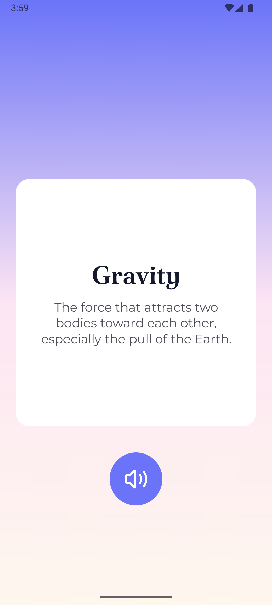

# 🎨 Challenge Set - May 2025 - Learning & Study Tools

Part of the **Mobile Dev Campus Main App Challenge** by [Philipp Lackner](https://pl-coding.com/campus)

## Mini challenge 1 : [Easy] - Lesson Overview Sheet
### 🎭 Scenario
A student opens their tablet, ready to review their lessons… only to find a stretched-out, sad-looking mobile layout crying for help. Whether it’s a phone or a tablet, the lesson list should look like it belongs. You’re here to fix that and give every device a lesson in proper UI.
### 🎯 Feature Goal
Design a responsive lesson overview screen that adapts its layout gracefully between phone and tablet sizes.
### 🎥 Demo

---

## Mini challenge 2 : [Easy] - Daily Word Card
### 🎭 Scenario
You’re halfway through your morning coffee when your brain reminds you: “We agreed to learn one new word a day, remember?” But dictionaries are long. Flashcards are lost. And your cat sat on your notes. Thankfully, a genius idea hits: a minimalist app that serves one word and its meaning daily, spoken aloud so even your half-asleep self can absorb it. Sounds great, right?
Yeah, well… now you have to build it—time to ship that Word of the Day screen.
### 🎯 Feature Goal
Create a single-screen “Word of the Day” experience that displays a randomly selected word and definition in a clean, focused card layout, with a one-tap button to hear both read aloud via Text-to-Speech.
### 🎥 Demo

---

## Mini challenge 3 : [Easy] - Searchable Study List
### 🎭 Scenario
You’re cramming for an exam with 20 tabs open, a study list somewhere in there, and brain cells slowly melting. You try to find that one topic on “clouds,” but your scroll finger files a complaint. Enough is enough. It’s time for a filtered, focused study list that listens as you type. Lucky for future-you, you’re building it now.
### 🎯 Feature Goal
Create a scrollable study topic list with a real-time search bar that filters items by either title or subject using a single intuitive text input.
### 🎥 Demo

---

## Mini challenge 4 : [Medium] - Study Feed Switcher
### 🎭 Scenario
You launch a sleek new study app and everything looks perfect—until someone tilts their phone sideways and the vertical list just… stays vertical. Awkward. Meanwhile, tablets are stuck pretending to be giant phones. Let’s face it: your feed needs to adapt. Whether users scroll or swipe, one card at a time should shine like it belongs there.
Time to make your feed smarter than gravity.
### 🎯 Feature Goal
Create a fullscreen, responsive feed of lesson cards that switches between vertical scrolling and horizontal paging based on device orientation and screen size, using adaptive layout techniques.
### 🎥 Demo

---

## Mini challenge 5 : [Hard] - Scrollable Study Board
### 🎭 Scenario
You open a study app, ready to find that one lesson about volcanoes… and instead, get lost in a never-ending scroll swamp. There’s no progress bar, no way to jump around, and worst of all—you just scrolled past item #49 only to realize you were looking for #3. Clearly, this isn’t just a list—it’s a battlefield. One only a brave Compose dev like you can tame. Let’s organize the chaos into a scrollable, tappable, jumpable, pinnable, and just plain usable study board.
### 🎯 Feature Goal
Develop a responsive and fully interactive study content board with 50+ categorized items, supporting sticky headers, pinning, index tracking, scroll-to-jump with visual highlight, and smooth scroll state preservation.
### 🎥 Demo

---

## 🧠 What I put in practice

- Layouts with Jetpack Compose  **adaptive layouts**, **gradients**, **constraint layout in compose**, **edge-to-edge UI**, **flow rows**, **Lazy column - sticky headers**, **View Pager (vertical, horizontal)**.
- Use the **Tex-to-Speech** API for device read-aloud.
- Save states throught **configuration changes** for great user experience
- Using **scrollables state handler** efficiently
- Use **debounce flow** to manage UI updates efficiently

---

## 📜 License

This project is open-source and free to use. Attribution appreciated! 🙌

---

## 🤝 Acknowledgements

Special thanks to [Philipp Lackner](https://pl-coding.com/campus) and the **Mobile Dev Campus** community for inspiring this mini challenges and helping sharpen real-world development skills.

---